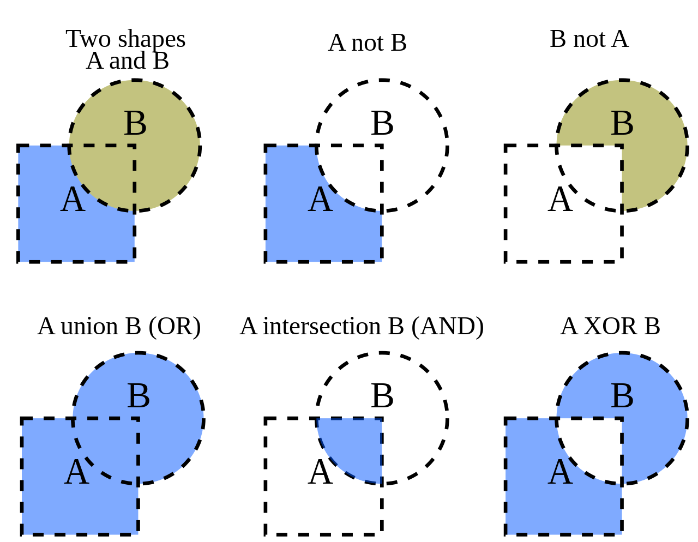

# Boolean Operations on Polygons

## Basic Information
Boolean operations on polygons are a set of Boolean operations (AND, OR, NOT, XOR, ...) operating on 2d plane.

## Problem to solve
There are lots of previous algorithms providing solutions in the field of polygons' boolean operations, such as Sutherland–Hodgman algorithm, Weiler–Atherton algorithm, Vatti algorithm, or Greiner–Hormann algorithm. Unfortunately, the problem is most of them have own limitations.

| Algorithm | Limitation |
| :---: | --- |
| Sutherland–Hodgman | can't handle concave polygon |
| Weiler–Atherton | can't handle concave polygon |
| Vatti | slower than Greiner-Hormann |
| Greiner–Hormann | can't handle coincident edges |

The target for this porject is to make a robust library which can dealing with different types of input. Users may not be worried about convex or concave polygon problems. I will also try to improve the performance as well.

## Prospective Users
These sets of operations are widely used in computer graphics, GIS, CAD, and EDA (in integrated circuit physical design and verification software).

## System Architecture
- operation unit
  - write in c++
  - including most calculations
- test unit
  - write in python
  - both testing the correctness and speed
- visualization unit
  - write in python
  - make complex polygon operations be intuitive

## Api Description
### C++
- `vertex` class
  - define vertex
- `polygon` class
  - define polygon by `vertex`
  - function checking polygon properties, such convex or not
- `bool_operator_with_polygon` functions
  - take polygons as arguments
  - deal with and, or, xor, not operations
### python
- test unit
- visualization unit

## Engineering Infrastructure
| Category | Tools |
| --- | --- |
| Automatic Build System | gnu make |
| Version Control | git, use branch to devide main(prod) and stg env |
| Testing Framework | pytest, unittest |
| Documentation | tbd |

## Schedule
| Week | Date | target |
| --- | --- | --- |
| Planning phase | 9/19 to 11/7 | prepare proposal |
| Week 1 | 11/7 | study algorithms and find solutions for limitations |
| Week 2 | 11/14 | implement the chosen algorithm with simple unit test |
| Week 3 | 11/21 | implement the utilities to visualize the result |
| Week 4 | 11/28 | wrap api, create makefile, and start to do whole unit test |
| Week 5 | 12/5 | solve any problem in test |
| Week 6-7 | 12/12 to 12/19 | prepare presentation