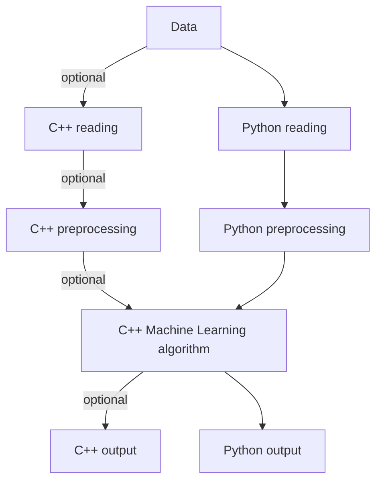

# Simple Machine Learning Toolkit

## Basic Information
A simple library for machine learning, such as regression, classification, clustering.  
[My Project Link](https://github.com/BensonYang1999/simple_ML_toolkit)

## Problem to Solve
I'm trying to build a library in C++ to make machine learning faster and multipurpose.

There are lots of tools for machine learning in python, but they may not be as efficient as using c++. So I'm going to build a machine laarning library in c++ to make it run faster and easily used for C++ users.

## Prospective Users
Anyone who want to use machine learning in either C++ or Python to solve various problems.

## System Architecture
Use `C++` to implement various algorithm  
Use `Python` to read data  
Use `pybind11` to convert `C++ library` to `Python library`  

## Engineering Infrastructure
 - Environment: Ubuntu 20.04
 - Compiler: g++, python
 - Build System: make
 - Version Control: git
 - Test Framework: pytest

## Schedule
 - Week 0 (11/02): project planning and writing proposal
 - Week 1 (11/07): construct c++ class structure
 - Week 2 (11/14): code and test regression approach
 - Week 3 (11/21): code and test classification approach
 - Week 4 (11/28): code and test clustering approach
 - Week 5 (12/05): combine every approach and test them
 - Week 6 (12/12): test and optimize every algorithm
 - Week 7 (12/19): buffer time for optimize and presentation
 - Week 8 (12/26): prepare presentation slides

## References
 - [Linear Regression](https://en.wikipedia.org/wiki/Linear_regression)
 - [k-nearest neighbors](https://en.wikipedia.org/wiki/K-nearest_neighbors_algorithm)
 - [k-means clustering](https://en.wikipedia.org/wiki/K-means_clustering)
