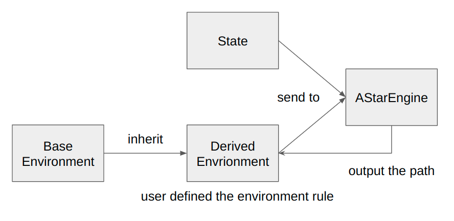
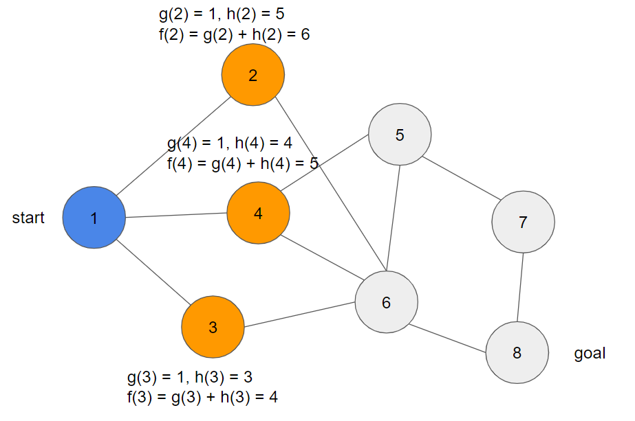
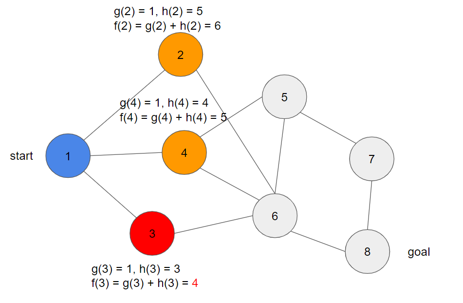
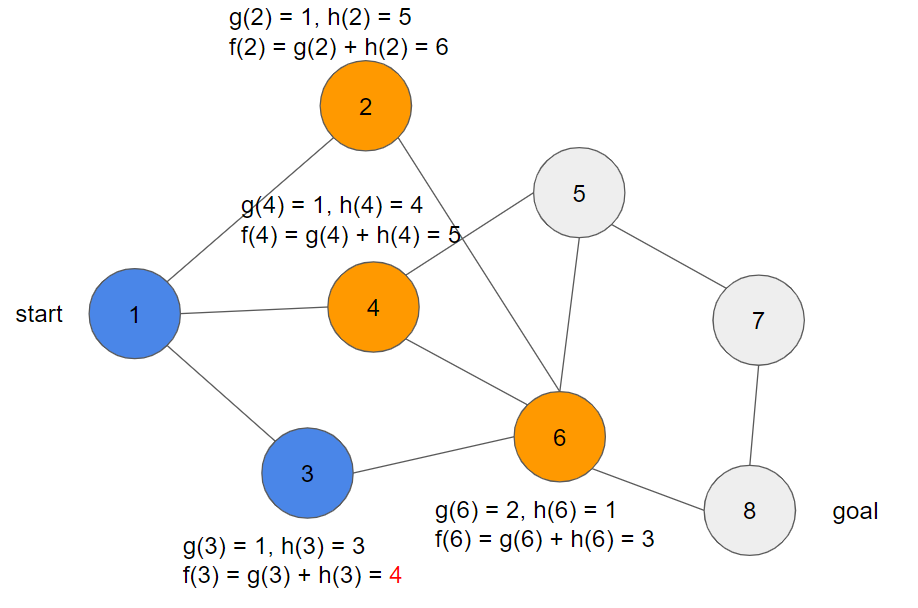
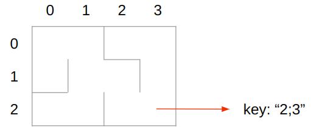
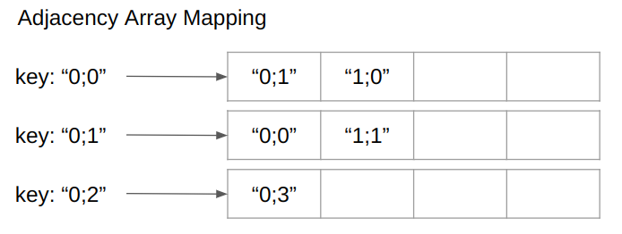

========================
A Star Search Engine
========================

Basic Information
=================

My Project Link: `<https://github.com/DerrickPikachu/AStarEngine>`

Problem to Solve
================

Path Finding problem is really famous in Computer Game AI. Maze, Sliding Puzzle, or Magic Cube are Path Finding games. Also in mordern video games, to find the
path for the NPC is a Path Finding problem.
To takle this problem, there are some algorithm we may come up with, like Dijkstra and Breadth-First-Search.
However, Breadth-First-Search waste too much time on searching in breadth.
A* Search, which combine the feature of Dijkstra and Best-First-Search, can efficiently find the path. 
This project provide a C++ API for Python.
User who want to utilize the A* Search can build the game (or environment) in Python or C++ and call the A* Search Engine to help him/her finding path.

Prospective Users
=================

The programmer who want to find a path on a graph or want to solve a Path Finding problem.
They can build their graph environment in Python or C++, and export the graph to A* Search Engine.
Then the engine will output the path for the user.

System Architecture
===================

Here is the project work flow. There are three important component in this project: Environment, State, AStarEngine.
State will record the state information, and environment need to know how to read the state data and the state transition rule should be defined to transfer the state to next state.
The AStarEngine do the A* search with the specified enrionment and the initial state.

The A* search algorithm can be illustrate as following:

In the image above, blue node means the node has been visited, orange node means the node can be visited, the other nodes are nodes which cannot be choosed to visited.
Now we need to choose a best node to visit. In A* search, those node needs to be evaluated with g(n) and h(n).
g(n) gives the path length from start node to node n.
h(n) is the heuristic function which is given by the game(or environment) domain knowledge, estimate a path length from node n to goal node.
f(n) is the final score for the node n, it can be calculated by simply adding g(n) and h(n) together.

With the information about those orange nodes.
Choose the node which has lowest f(n), and color this node as red.

Then extend the red node, evaluate the node which can be reached by the red node and color the node as orange.
After finishing this process, the red node has beed visited. Therefore, color this red node to be blue.

Loop this process until find a path from start node to goal node.

The data structure of the graph will use adjacency matrix to describe the edge information.
Class State is about the node information. There is an important member in State: A node key.

Node key is generated by encoding the node information to a string and will uniquely map to a state.
That's mean every state has it's unique key.
If user want to build his/her game, they should define how to encode game state to a key, and how to decode a key to a state.

For example: Maze node can be represented by the position, like key string "2;3" means the node on the second row and third column.

The environment should also define the state transition rule (defined by user).
This rule help to change the node key to represent a new state.

Then the adjacency matrix can be designed to be string to array mapping.
One node key map to an adjacency array.

This system need the user to specify the game detail and the game heuristic.
Users can define their game in Python or C++. 
It would be easy to implement if the game details were defined in Python, but the search is expected to be a little bit slower.

API Description
===============

User can directly use the CLI to enjoy the basic example game (or environment) to experience the A* search engine.

Or if they want to try the other game, they can implement their game environment derived from the environment class interface and override the method:

:math:`state state_transition(state, action)`

  state_transition defines how to transfer the current state into next state by appling an action. The first parameter is the current state, the second parameter is the desired action.

:math:`action[] valid_actions(state)`

  valid_actions return all the valid actions on the input state.

:math:`float astar_heuristic(state)`

  astar_heuristic is the needed user defined function used for A* search. This function is very important and will affect how quickly will A* search find a path.
  In different game, there would be a different heuristic functions. User can define their own heuristic function for their own game.

After defining the game environment, he/she should set the environment instance and the initial state for A* search engine as following:

:math:`AStarEngine.setup(environment, state)`

  The setup method will help engine to get the environment instance and the initial state, those information is used for the next step.

Then execute the A* search:

:math:`AStarEngine.run()`

  This method will start to execte A* search and find the path for user.

Engineering Infrastructure
==========================

To build the A* Search Engine in c++, I would like to use CMake to automatically build my project.

Version Control: Git. Because this project will be written only by myself, I will use only one branch on development, and the master branch to be released branch.

Test Framework: GTest for C++, pyUnit for Python. C++ API will be wrapped into python and test by pyUnit.

The Documentation tool would be a rst file or markdown.

I will wrap a build environment (not the game enironment method above) into a docker container image, as the result, user can easily pull the image and enjoy the AStarEngine immediately.

Schedule
========

* Planning phase (6 weeks from 9/19 to 10/31): prepare proposal, study A* search and create repository
* Week 1 (10/31): build project prototype and define the environment data structure
* Week 2 (11/7): define the environment base interface
* Week 3 (11/14): implement the example game
* Week 4 (11/21): unit test for example game
* Week 5 (11/28): implement the A* search engine
* Week 6 (12/5): unit test for A* search engine
* Week 7 (12/12): system test for entire project
* Week 8 (12/19): prepare presentation

References
==========

`https://www.geeksforgeeks.org/a-search-algorithm/`
`https://zh.wikipedia.org/zh-tw/A*%E6%90%9C%E5%B0%8B%E6%BC%94%E7%AE%97%E6%B3%95`
