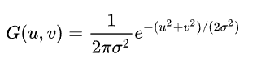
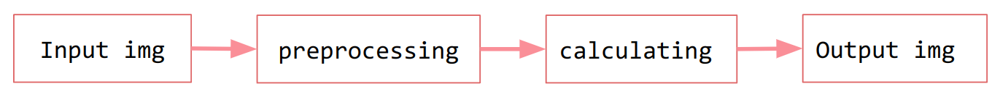

# Image Filtering 

## Basic Information
One common way to implement image filtering is using a NxN kernel to convolute the origin image. By setting different value in kernel, you will obtain distinct image after convoluting.The other way is to calculate the rgb separately according to the characteristics of the filter, for example, We get the new value by subtracting the old value from 255 for Film filter.

## Problem to Solve

In this project, I use c++ to make the calculation of image filters faster. The use python to show and store image. 

**Gussian blur** is useful for bluring image by Guassian function. It is widely use in Adobe Photoshop, GIMP, Paint.NET and so on. We setting the kernel with the normal distribution  in 2-dimension space: 

 


where `u` is the distance from the origin in the horizontal axis, `v` is the distance from the origin in the vertical axis, and σ is the standard deviation of the Gaussian distribution.

```
1.Convolution matrix radius of Gaussian blur: r (here we set r=1)
2.Standard deviation: σ 
        (it is appropriate to take 1/3 of the radius r of the convolution matrix)
```


    
    


The expecting outcome:
- bluring image
    
    <div>
        
        
    </div>

- filtering
    
    <div>
        
        
    
    </div>

## Prospective Users

Anyone who wants to filtering the image.

This project use pybind to wrap the c++ based Gussian blur function and other filter function to provide high-level API in python.

## System Architecture



## API Description

- Python
    - getParam() : get user's parameters.
    - show() : showing the image after filtering.
    - store() : store image in file.
        
- C++
    - Gussianblur() : calculate the gussian blur.
    - nostalgic() : calculate the rgb for nostalgic filter
    - colorChange() ： alculate the rgb for colorChange filter
    - film() ： alculate the rgb for film filter.
        
## Engineering Infrastructure
- Build System : Makefile
    - make
    - make test
    - make clean
- Version Control : Git
- Test : pytest

## Schedule


- week1(11/07): Setup Python and c++ environment
- week2(11/14): Python in/out screen, contructing GUI.
- week3(11/21): Research filter formulas
- week4(11/28): Implement Gussian blur in c++
- week5(12/05): Implement other filter in c++
- week6(12/12): Implement other filter in c++
- week7(12/19): Testing＆ Proposal making 
- week8(12/26): Project Present


picture reference:
https://www.twblogs.net/a/5eddc89bc98ca1ea826e5b2c
https://web.ntnu.edu.tw/~algo/Image.html#3


