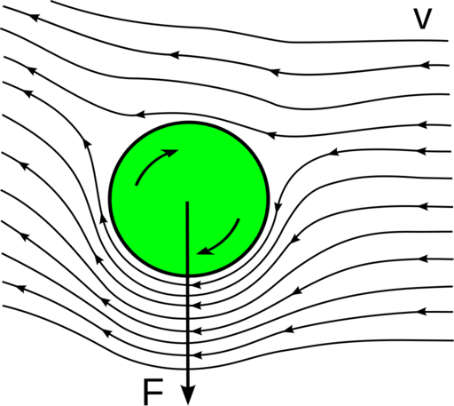
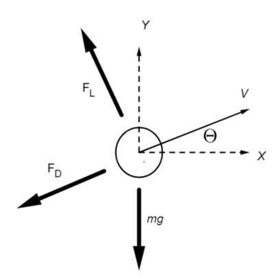

.. default-role:: math

========================
SpinningBall (22au)
========================

Basic Information
=================

My repository: <https://github.com/zurzeit/SpinBall.git>

Problem to Solve
================

As we watch the baseball game or table tennis game, we can see the spinning ball moves with a tricky trajectory. That is  because the Magnus effect gives an additional force to the ball. As the result, the ball drops rapidly.

After evaluating the free body diagram of a spinning ball, there are three external force exerting on the ball, which are gravity, drag and force from the Magnus effect. And we can get the following equations

$$\\ddot{y}=-g-\\frac{F_{D}}{m}\sin (\\theta)+\\frac{F_{L}}{m}\cos (\\theta)$$

$$\\ddot{x}=-g-\\frac{F_{D}}{m}\cos (\\theta)+\\frac{F_{L}}{m}\sin (\\theta)$$

$\F_{D}$ is drag force and $F_{L}$ is Magnus effect force. Their relation with some fluid attributes are shown in below:
$$\F_{D}=\\frac{1}{2}\\rho U^2\A\C_{D}$$
$$\F_{L}=\\frac{1}{2}\\rho U^2\A\C_{L}$$
where $A$ is the cross-area of the ball, 
$\\rho$ is the fluid density, 
$U$ is the relative velocity between the ball and the fluid,
$C_{D}$ is the drag coefficient which is related to the reynolds number,
$C_{L}$ is the lift coefficient which is related to the reynolds number as well.

Hence, the problem is to solve **non-linear differential equations**. The numeric method to solve this problem will be **Runge–Kutta methods**.

Prospective Users
=================

When users want to simulate the motion of a spinning ball, they can provide this function with the ball spinning rate(rpm), exit velocity(m/s), exit angle(radian) and the timestamps(sec) the user is interested. 

If user want to create a pitcher or catcher robot, knowing the trajectory in advance through our function is necessary. With the help of this tool, catcher robot can prepare for the possible final position of the curve ball and make the catching process smooth.

System Architecture
===================

(Py ) The user gives the required input information

(Py ) Initiate the computation of the ball states

(C++) Compute the spinning ball trajectory

(C++) Utilize the numeric method(**Runge–Kutta methods**) to solve the question

(C++) Return the position and states of the spinning ball over the given timestamps

(Py ) Visualize the ball movement.

API Description
===============

:math:`cal_traj(initial_states, ball_attributes, tspan)`

Given the initial states(e.g. exit angle, velocity) and the ball attributes(e.g. size), this function will return a matrix of the states over given timestamps.

:math:`viz_traj(traj)`

Given the trajectory from the outcome of the function $cal_traj$, this function will visualize the outcome of the ball trajectory.

Engineering Infrastructure
==========================

1. build system: Makefile will be my system building tool.

2. Version control: git will be my version control tool. In the preliminary version, the problem will be solved with a constraint that the rotation only in z-axis. Hence, the ball will only move in a x-y plane. When the problem has been solved, different rotation angle will be added to make the function more completed. This will make the ball movement more interesting. 

3. Testing framework: pytest and unittest will be used to do the test after wrapping the function into python.

4. Documentation: .rst will be used to record the information of this tool.

Schedule
========

* Planning phase (6 weeks from 9/19 to 10/31):
* Week 1 (10/31): plan for the development
* Week 2 (11/7): parallel programming study
* Week 3 (11/14): implement the physics part of the API function
* Week 4 (11/21): implement the Runge–Kutta methods
* Week 5 (11/28): test for the result
* Week 6 (12/5): visualization
* Week 7 (12/12): implement the 3D version of the problem
* Week 8 (12/19): preparing slides and refine the code

References
==========
.. [1] Magnus effect Wiki: https://en.wikipedia.org/wiki/Magnus_effect
.. [2] Table Tennis and Physics: https://www.intechopen.com/online-first/83844
.. [3] Chapter 6 - Rotating Cylinders, Annuli, and Spheres https://www.sciencedirect.com/science/article/pii/B9780123820983000068
