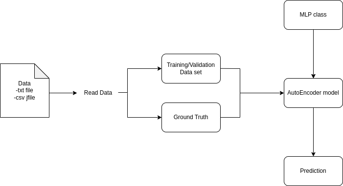

# AutoEncoder for arrhythmia detection

## Basic information

[GitHub](https://github.com/hychiu02/AutoEncoder-for-arrhythmia-detection)

Arrhythmia dectection using ECG signal

## Problem to solve
Heart diseases are one of the significant reasons for death all over the planet. To perform arrhythmia detection, Electrocardiograms(ECGs) is used to monitor hte functioning of heart by capturing electrical activity. Because of needs of real-time inference, the model sizeand  parameters should be small, autoencoder seems to be a good choice. I want to develop a method to build, train and inference a MLP model with C++. 

## Prospective Users
people who want to do abnormal sound detection, cardiac diseases classification or other regression or classification problem can take advantage of my implementation

## System Architecture
### Currently I implement functions to read csv files and train on ubuntu 20.04, I did not implement fucntions to read other datatypes and try on other platforms.  
There will be a Node class for storing weight, a Layer class with Nodes for forward and backward weights calculation and a MLP class containing Layers  
The flow will look like this



## API Description
- Dataset class
```
 Dataset
  the constructor initialize Dataset
  - parameters:
    dataPath: ECG file path
    
~Dataset
  destructor
  
len
  get dataset length
  - return :
    size_t: return dataset length
```

- MLP class
```
MLP
  the constructor use layersNodes, layersActivFuncs
  - parameters:
    layersNodes (vector<uint8_t>): number of nodes in each layer
    layersActivFuncs (vector<string>): activation function of each layer

~MLP
  destructor
  
load_model
  load trained model
  - parameters
    modelPath (string): path of model to be loaded
  - return
    (bool): load successfully or not

forward
  get prediction of given data from model
  - parameters:
    X (vector<float>): data to predeict
  - return
    y (vector<float>): prediction of given input data

backward
  update weights of each node in model
  - parameters
    loss (vector<float>): loss calcuated in final layer
    
save_model
  save trained model
  - parameters:
    save_path (string): path to save model

```

## Engineering Infrastructure
1. Automatic build system and how to build your program: GNU make
2. Version control: Git
3. Testing framework: Pytest

## Schedule

- Planning phase (9/16~10/31): Plan the architecture for overall program and study the detail of implementation like how back propogation works
- Week 1(10/31): Complete the class part Node, Layer, MLP
- Week 2(11/07): Component testing, and implement backpropagation
- Week 3(11/14): Complete the class part Dataset and manage data
- Week 4(11/21): Complete fuction part train, test 
- Week 5(11/28): Debug and make sure system 
- Week 6(12/05): Test performance(maybe compare inference time and accuracy with same model on pytorch eager mode)
- week 7(12/12~): prepare presentation

After class:
  Try to deal with I/O among different platform.
  Try to map this implement to gpu(cuda)

## References

- [MLP](https://chih-sheng-huang821.medium.com/%E6%A9%9F%E5%99%A8%E5%AD%B8%E7%BF%92-%E7%A5%9E%E7%B6%93%E7%B6%B2%E8%B7%AF-%E5%A4%9A%E5%B1%A4%E6%84%9F%E7%9F%A5%E6%A9%9F-multilayer-perceptron-mlp-%E5%90%AB%E8%A9%B3%E7%B4%B0%E6%8E%A8%E5%B0%8E-ee4f3d5d1b41)
- [AutoEncoder](https://medium.com/%E5%BC%B1%E5%BC%B1%E9%96%8B%E7%99%BC%E5%A5%B3%E5%AD%90-%E5%9C%A8%E6%9D%B1%E4%BA%AC%E7%9A%84%E9%96%8B%E7%99%BC%E8%80%85%E4%BA%BA%E7%94%9F/autoencoder-%E6%88%91%E5%B0%8D%E4%B8%8D%E8%B5%B7%E4%BD%A0%E4%B9%8B-%E9%87%8D%E6%96%B0%E8%AA%8D%E8%AD%98autoencoder-%E7%AC%AC%E4%B8%80%E7%AF%87-d970d1ad9971)
- [Artificial Neural Network Based Cardiac Arrhythmia Classification Using ECG
Signal Data](https://ieeexplore.ieee.org/stamp/stamp.jsp?arnumber=5559887)
