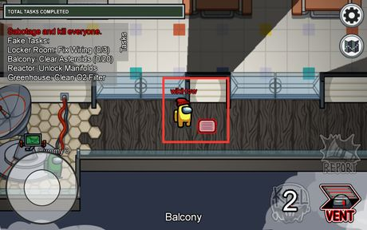
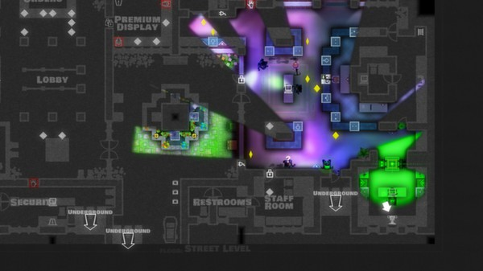
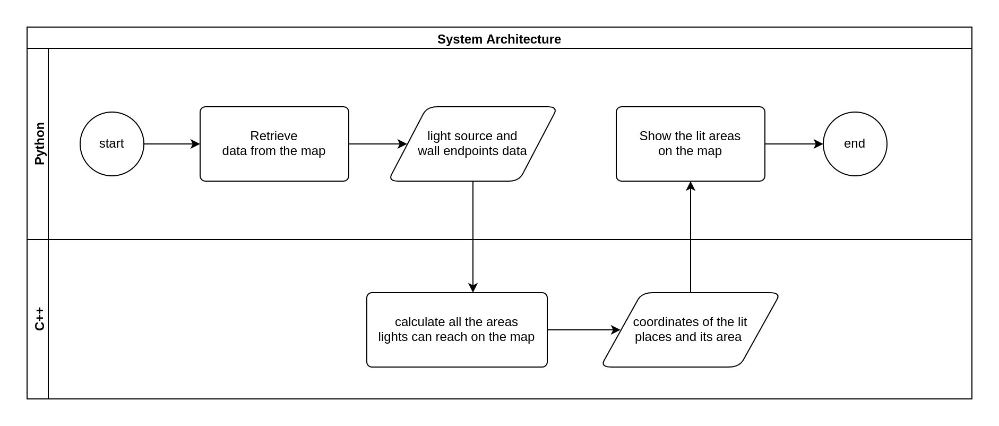

# Raycast2D

## Basic Information

Simulate how lights radiate from a single light source on a 2D map.

* github repository: [https://github.com/shih-chuan/Raycast2D](https://github.com/shih-chuan/Raycast2D)

## Problem to Solve

The problem this system wants to solve is to calculate all the areas where lights from a given single light source can reach on a 2D map.

There are some algorithms can be implemented for solving this problem. Before we dive into the topic deeper, let's first talk about the Line of sight(LOS) algorithm, which tells us how to simulate the travel of a "single" ray casted from a light source.

* Line of sight(LOS) algorithm: Input the x,y coordinates for the target and the light source and then walk along a line between them. At each coordinates on the line, the algorithm checks if anything in the map blocks the light from reaching the target.

However, a light source doesn't only cast a single ray, but it radiates infinite rays. To solve the problem, a naive approach is to cast rays to every potential destination, but this is time consuming. We can use the following algorithms, provided by the [redblobgames](https://www.redblobgames.com/articles/visibility/), to improve the efficiency.

* Ray casting: Cast the rays only at angles where the walls begin or end, and fills the triangles produced by these rays.
* Wall Tracking: The above algorithm has a problem, it has to intersect with every single wall. Combining the ray casting and wall intersection into a single algorithm is a more efficient approach. This can be achieved by sweeping around 360° and keeping track of the walls that intersect the sweep line. Here is the pseudo code in `python`:

  ```python
  walls = get_walls()
  endpoints = get_endpoints() # list of endpoints, sorted by angle
  open = []  # list of walls the sweep line intersects

  for endpoint in endpoints:
      nearest = nearest_wall(open, light_source) # remember which wall is nearest

      for wall in walls:
          # add any walls that BEGIN at this endpoint
          if wall.begin == endpoint:
              open.append(wall)
          # remove any walls that END at this endpoint
          if wall.end == endpoint:
              open.remove(wall)
      
      cur_nearest = nearest_wall(open, light_source) # figure out which wall is now nearest

      # if the nearest wall changed fill the current triangle and begin a new one
      if nearest != cur_nearest:
          fill_triangle(nearest, cur_nearest, light_source)
  ```

## Prospective users

* Game Developer: Determine whether something in a game world is visible for a character is very common in game developing. There are even games making this as one of their main features, like [Monaco](https://store.steampowered.com/app/113020/Monaco_Whats_Yours_Is_Mine/?l=tchinese) and [Among us](https://store.steampowered.com/app/945360/Among_Us/)

|  |  |
|:-----------------------------------:|:-----------------------------------:|
| **Among us** |**Monaco**|

* House planning for Wireless Network: Wi-Fi signals are most weakened by having to go through thick walls. To avoid signals from being weakened by the walls, this system may provide some insights to plan the wireless network in your house.

## System Architecture

The system should provide a graphical user interface allow users to design a 2D map, place walls and move a light source to play around. Additionally, when the user is interacting with any objects on the map, the system needs to highlight the area reachable from the light source on the map in real time.

|  |
|:-----------------------------------:|
| **System flow chart** |

## API Description

* Python API:
  * `addWall(start, end)`: create a wall on the map and return its id
  * `rmWall(wall_id)`: remove the wall by its id
  * `moveLightSource(dest)`: move light source to the destination coordinate
  * `lightArea(walls, light_source)`: call the c++ api and show the lit area on the map

* C++ API:
  * `lightArea(walls, light_source)`: calculate all the areas where lights from a given single light source can reach on a 2D map and return the coordinates of the lit places and its area.

## Engineering Infrastructure

* Automatic build system: `cmake`
* Version control: `git`
* Testing framework: `pytest`
* Documentation: GitHub `README.md`

## Schedule

Planning phase (6 weeks from 9/19 to 10/31): Setup the environment and get familiar with the algorithm

Week 1 (10/31): Implement the algorithm with C++

Week 2 (11/7): Make python wrappers for C++ with `pybind`

Week 3 (11/14): Finish C++, and start creating the interactive map in python

Week 4 (11/21): Implement features of the interactive map

Week 5 (11/28): Test all features with `pytest`

Week 6 (12/5): Finish up, debug, and write the documentation

Week 7 (12/12): Buffer time for further testing and debugging

Week 8 (12/19): Make slides and prepare for the presentation

## References

* [red blob games](https://www.redblobgames.com/articles/visibility/)
* [sight and light](https://ncase.me/sight-and-light/)
