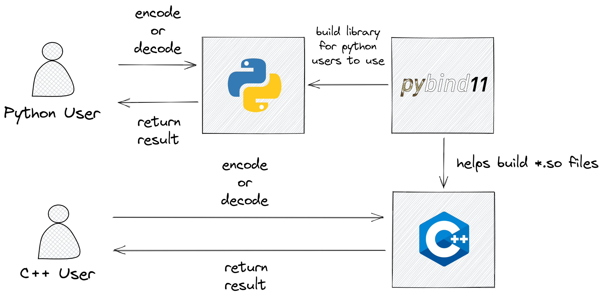

# Stream VByte

## Basic Information

A `C++` implementation with `Python` bindings of Stream VByte, which is an efficient integer compression technique.

GitHub repository: <https://github.com/wst24365888/stream-vbyte>

## Problem to Solve

Integer compression can often be used in many places. One of the most famous is VByte, which is everywhere. 

In 2015, a well-known speedup version was proposed, Masked VByte (Vectorized VByte Decoding), which data format is the same as the standard VByte, using SIMD to speed up the decoding process, but its proposed algorithm has some limitations, such as only considering first 12 bytes in 16 byte input data and a hardcoded table that requires a lot of pre-computation. 

Later, one of its authors, Prof. Daniel Lemire, proposed Stream VByte which uses a different data format, splitting the control bytes and data bytes. This results in better access speed and it's more suitable for SIMD approaches.

This project is a `C++` implementation of Stream VByte, including `Python` bindings in newer versions, which was previosly lacking.

## Prospective Users

- Users that want to make integer compression
  - `MIDI` files
  - database
  - IoT
  - `RPC` frameworks like [thrift](https://github.com/facebook/fbthrift), [grpc](https://github.com/grpc/grpc) (they use `protobuf (varint)` instead)

## System Architecture

## API Description

- `Python` API
  - `encode(data: numpy.ndarray) -> numpy.ndarray`
  - `decode(data: numpy.ndarray, original_length: int) -> numpy.ndarray`

- `C++` API
  - `size_t encode(const uint32_t *in, uint32_t original_length, uint8_t *out);`
  - `void decode(const uint32_t *in, uint8_t *out, uint32_t original_length);`

> Might have changes due to `pybind11` data type conversion.

## Engineering Infrastructure

- Automatic build system: `GNU make`
- Version control: `git`
- Testing framework: `pytest`
- Documentation: GitHub `README.md`

## Schedule

Week 1 (10/31): Do the research of papers mentioned above

Week 2 (11/07): Implement the `encode` algorithm in the paper using `C++`

Week 3 (11/14): Implement the `decode` algorithm in the paper using `C++`

Week 4 (11/21): TBD, I don't think I can implement the algorithms in just two weeks

Week 5 (11/28): Make `python` wrappers for `C++` with `pybind`

Week 6 (12/05): Test all features with `pytest`

Week 7 (12/12): Setup CI pipeline and write documentation

Week 8 (12/19): Make slides and prepare for the presentation

## References

- <https://www.wikiwand.com/en/Variable-length_quantity>
- [Jeff Plaisance, Nathan Kurz, Daniel Lemire - Vectorized VByte Decoding, International Symposium on Web Algorithms, 2015](https://arxiv.org/abs/1503.07387)
- [Daniel Lemire, Nathan Kurz, Christoph Rupp - Stream VByte: Faster Byte-Oriented Integer Compression, Information Processing Letters 130, 2018](https://arxiv.org/abs/1709.08990)
